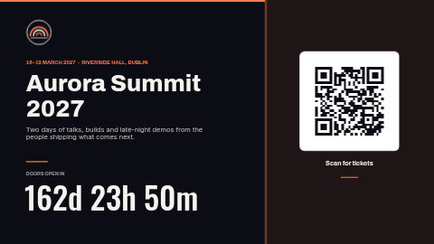

# Event countdown

A launch screen for a conference, opening, product launch or sale: the event name, a tagline and
the date and venue on the left, a big live countdown underneath, and a ticket or RSVP QR code on a
tinted panel on the right. When the moment arrives the countdown is replaced by your own message
("Happening now").

**Kind:** slide (declarative — no code runs). Works on every ScreenTinker player that shows slides.

## Settings

| Setting | Type | Default | What it does |
| --- | --- | --- | --- |
| Event name | text (48) | `Aurora Summit 2027` | The big headline. Up to about 24 characters fit on two lines. |
| Tagline | text (110) | a one-sentence pitch | Under the name, in lighter type. |
| Date and venue line | text (60) | `18–19 MARCH 2027 · RIVERSIDE HALL, DUBLIN` | The small accent-coloured line above the name. Plain text — type it the way you want it to read. |
| Count down to | text (40) | `2027-03-18T09:00:00+00:00` | The moment the countdown reaches zero. **Format below.** |
| Label above the countdown | text (40) | `DOORS OPEN IN` | Small caption over the numbers. It stays after the countdown ends, so pick words that still read well then (or clear it on the day). |
| Shown when the countdown ends | text (24) | `Happening now` | Replaces the numbers once the target has passed. |
| Show the ticket QR code | checkbox | on | Turn off when you have no link: the code, its white card, caption and rule all disappear (the tinted panel stays). |
| Ticket / RSVP link | text (300) | `https://example.com/aurora/tickets` | What the QR opens. Shorter links give a coarser code that scans from further away. |
| QR caption | text (32) | `Scan for tickets` | Under the code. |
| Logo | image | the bundled placeholder `logo.svg` | Top left, in a square-ish box. A transparent PNG or SVG works best. |
| Background photo | image | none | Optional hero or venue photo behind everything. |
| Darken the photo | number 0–0.9 | `0.6` | A black scrim over the photo so the text stays legible. Ignored without a photo. |
| Accent / Background / Text colour | colour | `#FF7A45` / `#0B0C14` / `#F6F3EE` | The accent colours the date line, rules, top bar and the panel tint. |

### The countdown target format

Use **ISO 8601 with a timezone offset**:

- `2027-03-18T09:00:00+00:00` — 09:00 in London (winter), or write `2027-03-18T09:00:00Z`
- `2027-03-18T09:00:00-04:00` — 09:00 in New York during daylight saving time
- `2027-03-18T09:00:00+01:00` — 09:00 in Paris (winter)

The offset is the one **in force on the event date** (summer time included). Without an offset
(`2027-03-18T09:00`) the time is read in the **ScreenTinker server's** timezone, which is often UTC
and rarely what you meant. A date on its own (`2027-03-18`) means midnight UTC. A plain number is
also accepted and read as milliseconds since 1970 (UTC).

An empty or unreadable value leaves the countdown blank (nothing breaks). The numbers read `162d 23h
50m` while days remain, then `5h 12m 30s`, then `4m 05s` — that format is fixed by the player. The
countdown runs on each screen's own clock, so keep your players' time in sync (NTP).

## Tips

- The slide is laid out at 16:9. On a portrait or very wide zone the player letterboxes it rather
  than stretching it.
- Event names over about 24 characters wrap to a third line and start to crowd the tagline — keep
  the name short and put the rest in the tagline.
- Test the QR with a phone before the event: point it at the screen from where people will stand.

## Files

- `template.json` — the slide (`template` = layout, `fields` = the words), with `{{param:…}}` placeholders
- `logo.svg` — placeholder mark, original work, MIT (see `NOTICE`)
- `thumbnail.png` — catalog preview

Licence: MIT (see `LICENSE`).
