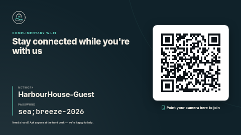

# Guest Wi-Fi

Your guest network name and password in large, legible type, next to a QR code that joins the
network in one scan. Made for hotel lobbies, cafés, clinics, co-working spaces and meeting rooms.
Full screen it is words on the left and the code on the right; in a portrait zone it becomes a
poster; in a thin strip it is the code and the two values side by side.

**Kind:** html. It draws the QR code on the screen with a small bundled encoder — nothing is
fetched (`"network": []`), and the password never leaves the page.



## The password is shown on purpose

This template is for a **guest** network whose password you would otherwise print on a table card.
Anyone who can see the screen can read it, and anyone who scans the code gets it. Do not use it for
a staff or office network. If you want the code without the password written out, turn off *Show
the password as text* — but remember the code itself still contains the password; anyone can read
it with a QR app.

## Settings

| Setting | Type | Default | What it does |
| --- | --- | --- | --- |
| Network name (SSID) | text (32) | `HarbourHouse-Guest` | Exactly as phones list it — capitals and spaces matter. Empty shows a "add your network name" placeholder instead of a code. |
| Password | text (63) | `sea;breeze-2026` | Type it exactly as it is. Special characters are handled for you (see below). |
| Security | select | WPA / WPA2 / WPA3 | Pick *WEP* only for very old routers; *Open* for a network with no password (the password is then ignored and the screen says "No password needed"). |
| The network is hidden | checkbox | off | Adds the "hidden" flag to the code, for networks that do not broadcast their name. |
| Show the password as text | checkbox | on | Off: the password line reads *Text when the password is not shown* instead. The code still joins. |
| Small heading | text (40) | `Complimentary Wi-Fi` | Accent-coloured line above the headline. |
| Headline | text (70) | `Stay connected while you're with us` | |
| Hint under the code | text (40) | `Point your camera here to join` | Empty hides it. |
| Label for the network name / password | text (24) | `Network` / `Password` | Translate these for your guests. |
| Text for an open network | text (40) | `No password needed` | |
| Text when the password is not shown | text (40) | `Scan the code to join` | |
| Footer | text (100) | a front-desk line | Hidden in the strip layout. |
| Logo | image | the bundled placeholder `logo.svg` | Empty hides it. Hidden in the strip layout. |
| Accent / Background / Text colour | colour | `#5CC8B5` / `#10222A` / `#F3EDE3` | The code is always dark on a white card, whatever colours you pick, so it stays scannable. |

## How the code is built — and why this is an HTML template

The code holds the standard Wi-Fi payload that iOS and Android cameras understand:

```
WIFI:T:WPA;S:<network name>;P:<password>;;
```

In that format `;` `:` `,` `"` and `\` are separators, so inside a name or password each must be
preceded by a backslash. A password like `sea;breeze-2026` has to be encoded as `sea\;breeze-2026`;
unescaped, the phone reads the password as `sea`, the code still *scans*, and the guest gets
"incorrect password" with no clue why.

A slide template can only paste your text into its QR element as is, so it could not do this — the
escaping would have to be typed by you, and the escaped password would then also appear, backslashes
and all, in the big text on screen. This template does the escaping in code (`app.js`,
`wifiEscape`), so you type the real password once and both the text and the code are right.
Non-ASCII names (`Café Zoë`) are encoded as UTF-8.

The encoder (`qr.js`) is written for this template: byte mode, error correction level M, versions
1–20, standard mask selection. It was checked by decoding generated codes across every version and
error-correction level, including payloads with all five special characters and accented text.

## Files

- `index.html`, `style.css`, `app.js` — the page
- `qr.js` — the QR encoder (original, MIT)
- `logo.svg` — placeholder logo, original work, MIT
- `fonts/` — Inter and JetBrains Mono (SIL OFL 1.1, licence texts alongside; see `NOTICE`)
- `thumbnail.png` — catalog preview

Licence: MIT (see `LICENSE`); fonts under the SIL Open Font License 1.1.
