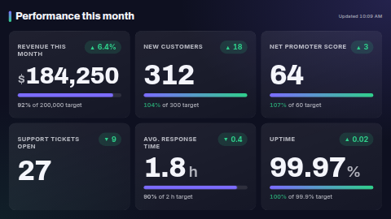

# KPI dashboard

Big, glanceable metric tiles. Each tile shows the metric name, a large formatted value (currency
units as a prefix, `%`, `h` and other units as a suffix), a ▲/▼ **change chip** coloured good or bad,
and a **progress bar to target** that turns green once the target is hit. The grid fits 1 to 12
tiles to any zone shape — landscape, portrait, or a thin strip (wider than about 3:1, where the
header is hidden and the tiles go side by side).

**Kind:** html (code, reviewed). **Network:** none — nothing is fetched by the page; data sources are
synced by the ScreenTinker server and handed to the page when it renders.

## Settings

| Setting | Type | Default | What it does |
| --- | --- | --- | --- |
| Metrics data source | data source (optional) | none | A table-shaped source. See below. |
| Metrics | textarea | six example KPIs | Used when no source is bound, or the source has no usable rows. One per line: `Metric \| Value \| Target \| Unit \| Change`. Only Metric and Value are required. |
| Title | text (60) | `Performance this month` | Heading at the top left. |
| Show at most | number 1–12 | 12 | Rows beyond this are ignored. |
| Show progress to target | checkbox | on | Hide the bar and the "x% of target" line. |
| An increase is good | checkbox | on | A positive change is coloured with the good colour. Metrics whose name contains *open, backlog, response, wait, queue, churn, cost, spend, error, incident, bug, latency, downtime, defect* or *complaint* are treated the other way round (fewer open tickets is good). Untick for a board where every metric is "lower is better". |
| Accent / Good / Bad / Background / Text colour | colour | `#7C6CFF` / `#2FD08B` / `#FF6363` / `#0E1020` / `#F4F5FB` | |
| Number and date language | locale | the screen's | Thousands separators, decimal mark, compact numbers (1.2M), the "Updated" time. |
| Timezone for "Updated" | timezone | the screen's | |

### Values

- `184250` with unit `$` → **$184,250**; `99.97` with `%` → **99.97%**; values of a million or more
  are shown compact (**4.2M**). Decimals are kept as typed (up to 2).
- Text that is not a number (`n/a`, `Q3`) is shown as typed, without a progress bar.
- Change is shown as typed, minus its sign; the arrow and colour come from the sign of its first number.
  `0` or text without a number gets a neutral ■ chip.
- A target of 0 or no target → no progress bar.

## Data source setup

Bind any **table** source — Google Sheets, CSV (URL or upload), Manual table, or a REST API that
returns a list of objects. Use a header row with these columns (case and spacing don't matter; the
server turns `Metric` into the key `row1_metric`):

| Metric | Value | Target | Unit | Change |
| --- | --- | --- | --- | --- |
| Revenue this month | 184250 | 200000 | $ | +6.4% |
| Support tickets open | 27 | | | -9 |

Accepted alternative column names: *Name, KPI, Label, Title* for Metric; *Actual, Current, Amount,
Total* for Value; *Goal, Budget, Plan* for Target; *Units, Suffix* for Unit; *Delta, Trend, Diff,
Vs last* for Change. The source's `updated` time is shown top right ("Updated 14:05"); without a
source the time the page rendered is shown.

The page re-reads its data every 60 seconds and rebuilds the tiles only when something changed. The
server hands a template at most the first 300 flat values of a source, so keep sheets to the rows
you want on screen (12 at most are shown).

If the bound source has no `row_count`, or none of its rows has a Metric or Value column (for example
a weather source bound by mistake), the typed-in metrics are shown instead — the screen never goes
blank or shows `undefined`.

## Files

`index.html`, `style.css`, `app.js` — inlined by the server at render time. `fonts/` holds the
Archivo and Inter latin subsets (SIL OFL 1.1, see `NOTICE`).

Licence: MIT (see `LICENSE`); bundled fonts OFL-1.1.
