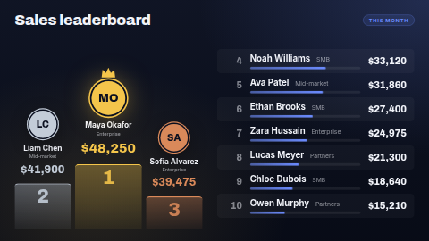

# Leaderboard

A ranked board for sales teams, fundraisers, step challenges, quiz nights or anything else with a
score. The top three stand on a gold, silver and bronze **podium**; everyone after them gets a row
with a **bar** as long as their score is close to the leader's. It animates in when it appears:
the podium rises, the bars fill.

Type the scores in, or connect a data source (a Google Sheet is the easy one) and the board re-sorts
itself whenever the sheet changes.

**Kind:** html (code, reviewed). **Network:** none — nothing is fetched; it works fully offline.

## Settings

| Setting | Type | Default | What it does |
| --- | --- | --- | --- |
| Title | text (40) | `Sales leaderboard` | The heading. |
| Period label | text (30) | `This month` | A pill beside the title. Empty hides it. |
| Logo | image | none | Optional, shown beside the title. |
| Scores | textarea | ten example sales reps | One per line: `Name \| Score \| Subtitle`. Any order; the board sorts it. Used when no data source is connected. |
| Scores data source | data source | none | Optional. A table-shaped source (Google Sheets, CSV, Manual table, REST list). When it has the Name and Score columns, it replaces the typed scores. |
| Name / Score / Subtitle column | text | `Name`, `Score`, `Team` | The column headings in your source. Case, spaces and punctuation don't matter. The subtitle column is optional. |
| Winner | select | highest score | *Lowest score wins* for lap times, golf and the like. |
| Score prefix | text (4) | `$` | Shown before every score. Empty for plain numbers. |
| Score suffix | text (12) | none | Shown after every score, e.g. `pts`, `km`, `%`. |
| Show at most | number 3–20 | 10 | Places shown, podium included. A small screen shows fewer rows rather than cramming them. |
| Show bars | checkbox | on | The progress bar under each name below the podium. |
| Heading font | select | Archivo | Archivo (display), Oswald (condensed) or Inter (clean). |
| Accent / Background / Text colour | colour | `#6C8CFF` / `#0B1020` / `#F2F4FA` | Accent colours the bars and the period pill. Podium colours are always gold, silver and bronze. |

### Scores

Scores can be typed however you like — `48250`, `48,250`, `$48,250.00`, `12.5 km` — and are
shown with thousands separators and the prefix and suffix you chose, with as many decimals (up to
two) as the most precise score. When both a comma and a dot appear, the last one is the decimal
point (`1.234,5` is 1234.5). A score that isn't a number is listed at the bottom, as typed.

Equal scores share a place (1, 2, 2, 4), and keep the order they were typed or listed in.

## Using a Google Sheet

1. Make a sheet with a header row: `Name`, `Score`, and optionally `Team`.
2. In ScreenTinker, *Data sources → New → Google Sheets* and point it at the sheet.
3. Choose that source for *Scores data source*. If your headings differ, type them into the column
   settings.

## Layouts

Landscape puts the podium beside the list; portrait puts it on top. In a wide strip zone (wider
than about 3:1) the plinths are dropped and the title, the top three and the list sit side by side.

## Files

`index.html`, `style.css`, `app.js` — all inlined by the server at render time. `fonts/` holds the
Archivo, Inter and Oswald latin subsets (SIL OFL 1.1, see `NOTICE`).

Licence: MIT (see `LICENSE`); bundled fonts OFL-1.1.
