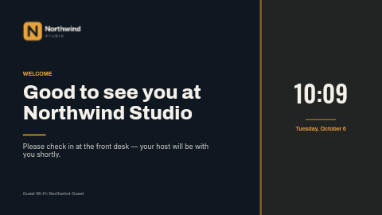

# Lobby welcome

A calm welcome screen for a reception, lobby or meeting-room door: a logo, a headline and a line
of detail on the left, and a live clock and date on a tinted panel on the right.

**Kind:** slide (declarative — no code runs). Works on every ScreenTinker player that shows slides.

## Settings

| Setting | Type | Default |
| --- | --- | --- |
| Logo | image | the bundled placeholder `logo.png` — replace it with an image from your content library |
| Small heading | text (40) | `WELCOME` |
| Headline | text (60) | `Good to see you at Northwind Studio` |
| Detail line | text (120) | a check-in instruction |
| Footer | text (80) | a guest Wi-Fi line |
| Accent / Background / Text colour | colour | `#E8A33D` / `#0F1720` / `#F4F1EA` |
| Clock timezone | timezone | empty = the screen's clock |
| Date language | locale | empty = the screen's language |
| Clock format | 24-hour / 12-hour | 24-hour |

Tips: a logo about 2.2 times as wide as it is tall fills its box exactly; headlines up to about 40
characters sit on two lines.

## Files

- `template.json` — the slide (`template` = layout, `fields` = the words), with `{{param:…}}` placeholders
- `logo.png` — placeholder logo, original work, MIT
- `thumbnail.png` — catalog preview

Licence: MIT (see `LICENSE`).
