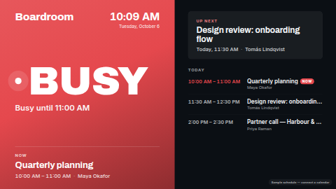

# Meeting room sign

A door sign for a meeting room. A huge **green AVAILABLE** or **red BUSY** band you can read from
down the corridor, with the room name, a clock, "Busy until 11:00" / "Free until 14:30", the meeting
in progress, the next meeting, and today's agenda (up to five bookings). Designed first for a
**portrait panel beside the door** (1080×1920); it also lays itself out for landscape screens and,
in a thin strip zone (wider than about 3:1), as a single line.

**Kind:** html (code, reviewed). **Network:** none — the page fetches nothing. The calendar is read
by the ScreenTinker server and handed to the page when it renders.

## Settings

| Setting | Type | Default | What it does |
| --- | --- | --- | --- |
| Room calendar | data source (optional) | none | A **Calendar (iCal)** source. See below. Without one a sample schedule is shown, marked "Sample schedule". |
| Room name | text (48) | `Boardroom` | Top left of the band. |
| Available text / Busy text | text (24) | `Available` / `Busy` | The big word — **only when the data source gives no status text**. A bound calendar supplies its own, in the language chosen on the data source (e.g. `FREI` / `BELEGT` for German). |
| Privacy: hide meeting titles and organisers | checkbox | off | Every title becomes the "Reserved" text and organisers are hidden. Times stay visible. |
| Text shown instead of a hidden title | text (32) | `Reserved` | Also used for a booking that has no title. |
| Show organisers | checkbox | on | Organiser next to the time, where the calendar provides one. |
| Headings | text (24 each) | `Now`, `Up next`, `Today`, `Coming up` | Translate these for your office. "Coming up" is used instead of "Today" when nothing is left today, and the list then shows the next bookings with their dates. |
| Text when nothing is booked | text (48) | `Nothing else booked` | |
| Available / Busy colour | colour | `#1FA971` / `#E5484D` | The band colour. White text is always used on the band, so pick colours dark enough for it. |
| Background / Text colour | colour | `#0B0F14` / `#F5F7FA` | The agenda half. |
| Clock | choice | Language default | 24-hour, 12-hour, or hide the clock. |
| Clock timezone / Clock language | timezone / locale | the screen's | Use the room's timezone if the player is set differently. |

## Data source setup

1. **Data sources → Add → Calendar (iCal)**. Paste the room's iCal address:
   - *Google Workspace:* the room resource calendar → Settings → "Secret address in iCal format".
   - *Microsoft 365 / Exchange:* publish the room mailbox calendar (Outlook on the web → Settings →
     Calendar → Shared calendars → Publish a calendar, "Can view titles and locations" or "Can view
     when I'm busy") and copy the ICS link. With "busy only" publishing, titles arrive as "Busy" —
     turn on Privacy mode for a cleaner sign.
   - Any other `.ics` URL works.
2. Choose the data source's language (status words and "Busy until …" come from it) and its
   refresh interval (5 minutes is typical).
3. Bind it to **Room calendar** in this template's settings.

Keys used (from the server's iCal resolver): `is_busy` decides green or red — never the translated
text — then `status`, `status_detail`, `current_title`, `current_time`, `current_organizer`,
`next_title`, `next_time`, `next_organizer`, `event_count`, `events_today_count` and
`event_N_title`, `event_N_time`, `event_N_date`, `event_N_organizer`. The booking in progress is
highlighted in the agenda. If the bound source is not a calendar (it has no `is_busy`), the sample
schedule is shown rather than a broken sign.

The page re-reads its data every 60 seconds; the band flips as soon as the server's next sync sees a
meeting start or end, so set the data source's refresh to match how quickly you need that.

## Files

`index.html`, `style.css`, `app.js` — inlined by the server at render time. `fonts/` holds the
Archivo and Inter latin subsets (SIL OFL 1.1, see `NOTICE`).

Licence: MIT (see `LICENSE`); bundled fonts OFL-1.1.
