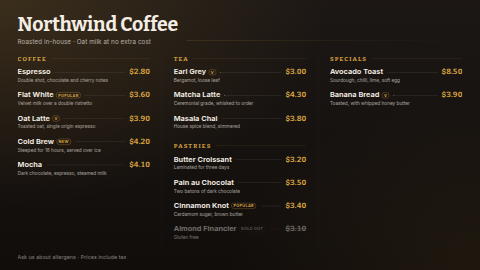

# Menu board

A café, restaurant or bar menu that lays itself out. Items are grouped by category, prices line up
on a dotted leader, short tags (`V`, `New`, `Popular`) sit beside the name as a pill, and anything
tagged **Sold out** is greyed with its price struck through. The board picks the number of columns
and the text size that fill the screen best, in landscape, portrait or a wide strip. If the menu is
too long to read comfortably on one screen, it is split into pages that fade from one to the next.

Type the menu in, or connect a data source (a Google Sheet is the easy one) so staff can change a
price or mark something sold out from a phone without touching the screen.

**Kind:** html (code, reviewed). **Network:** none — nothing is fetched; it works fully offline.

## Settings

| Setting | Type | Default | What it does |
| --- | --- | --- | --- |
| Title | text (40) | `Northwind Coffee` | The big heading. |
| Subtitle | text (80) | a tagline | One line under the title. Empty hides it. |
| Footer line | text (120) | allergens note | Small print along the bottom. Empty hides it. |
| Logo | image | none | Optional, shown beside the title. |
| Menu items | textarea | 14 café items | One item per line: `Item \| Price \| Description \| Category \| Tag`. Only the item name is required. Used when no data source is connected. |
| Menu data source | data source | none | Optional. A table-shaped source (Google Sheets, CSV, Manual table, REST list). When it has the Item column, it replaces the typed items. |
| Item / Price / Description / Category / Tag column | text | `Item`, `Price`, `Description`, `Category`, `Tag` | The column headings in your source. Case, spaces and punctuation don't matter (`Unit price` matches `unit_price`). |
| Currency symbol | text (4) | `$` | Empty shows bare numbers. |
| Currency position | select | before | `$3.50` or `3,50 €`. |
| Decimals | select | always two | `3.50`, only when needed (`3.5`, `4`), or none (`4`). |
| Use a decimal comma | checkbox | off | `3,50` instead of `3.50`. |
| Heading font | select | Bitter | Bitter (serif), Archivo (display), Oswald (condensed) or Inter (clean). Item text is always Inter. |
| Accent / Background / Text colour | colour | `#D9A441` / `#17120F` / `#F4EDE4` | Accent colours the category headings, prices and tags. |
| Seconds per page | number 5–120 | 12 | Only used when the menu doesn't fit on one screen. |

### Prices

A price that is a single number, with or without a currency sign (`3.5`, `$3.50`, `3,50`), is
reformatted with your currency and decimals settings. Anything else (`Market price`, `4 / 6`) is
shown exactly as typed. Leave the price empty for a heading-style line without a price.

### Categories

Categories appear in the order they first occur, and items keep their order inside each. An item
with no category is listed without a heading. When a category continues onto the next page, its
heading is repeated there with *cont.*

### Sold out

A tag of `Sold out` (also `Soldout`, `Sold`, `Unavailable` or `Out of stock`, any case) greys the
item and strikes its price. Change the tag back and the item returns.

## Using a Google Sheet

1. Make a sheet with a header row: `Item`, `Price`, `Description`, `Category`, `Tag`.
2. In ScreenTinker, *Data sources → New → Google Sheets* and point it at the sheet.
3. Choose that source for *Menu data source*. If your headings differ, type them into the column
   settings.

Only the first ~55 rows of a five-column sheet reach the template (a data source hands a template
at most 300 values), which is more than any screen can show.

## Files

`index.html`, `style.css`, `app.js` — all inlined by the server at render time. `fonts/` holds the
Archivo, Bitter, Inter and Oswald latin subsets (SIL OFL 1.1, see `NOTICE`).

Licence: MIT (see `LICENSE`); bundled fonts OFL-1.1.
