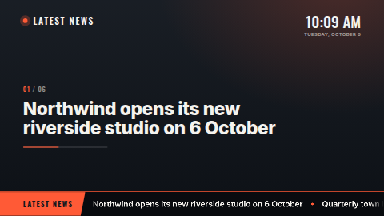

# News ticker

Your own headlines, typed in, shown two ways at once: a large **featured headline** that rotates
every few seconds with a progress bar, and a smooth **scrolling ticker** along the bottom. Put it in
a thin strip zone (wider than about 3:1) and it becomes just the ticker bar.

**Kind:** html (code, reviewed). **Network:** none — nothing is fetched; it works fully offline.

## Settings

| Setting | Type | Default |
| --- | --- | --- |
| Title | text (32) | `Latest news` |
| Headlines | textarea, one per line | six example headlines |
| Show at most | number 1–30 | 12 |
| Ticker speed | number 20–400 (px/s at 1080p) | 120 |
| Seconds per featured headline | number 4–60 | 8 |
| Accent / Background / Text colour | colour | `#FF5A36` / `#11161D` / `#F5F3EE` |
| Show the clock | checkbox | on |
| Clock timezone / Clock language | timezone / locale | the screen's own |

## Files

`index.html`, `style.css`, `app.js` — all inlined by the server at render time. `fonts/` holds the
Inter and Oswald latin subsets (SIL OFL 1.1, see `NOTICE`).

Licence: MIT (see `LICENSE`); bundled fonts OFL-1.1.
