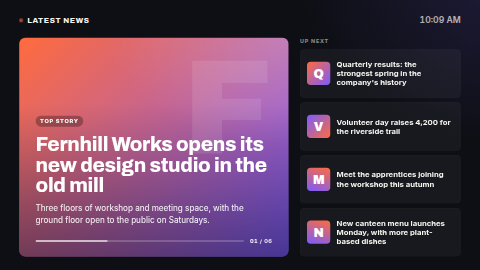

# News wall

A magazine-style news wall. A large **featured story** — kicker, headline, summary, date — rotates
every few seconds with a progress bar and a "03 / 08" counter, while the **next four stories** sit
beside it as cards. The feed's title and a clock run along the top. In portrait the cards stack
under the featured story; in a thin strip zone (wider than about 3:1) it becomes a single rotating
headline with the title and clock at the left.

**Kind:** html (code, reviewed). **Network:** none — the page fetches nothing. The feed is read by the
ScreenTinker server and handed to the page when it renders.

## Typographic by design — no feed images

This template shows **no pictures from the feed**, on purpose. It declares no network hosts
(`"network": []`), so the page's Content Security Policy only allows images that are bundled with
the template; a feed's remote image URLs would be blocked and leave empty boxes. Instead the design
is built from type and colour: a gradient featured card with the headline's initial as a giant
background letter, and gradient initial badges on the cards. It also means the wall works fully
offline once the server has synced the feed.

## Settings

| Setting | Type | Default | What it does |
| --- | --- | --- | --- |
| News feed | data source (optional) | none | An **RSS / Atom** source. See below. |
| Title | text (48) | empty | Empty uses the feed's own title; without a feed, "Latest news". |
| Stories | textarea | six example stories about a fictional company | Used when no feed is bound or the feed has no items. One per line: `Headline \| Short summary`. |
| Stories in rotation | number 1–20 | 8 | The first N items of the feed. |
| Seconds per featured story | number 4–60 | 10 | |
| Story dates | choice | Relative | "2 hours ago", a date and time, or hidden. Typed stories have no dates. |
| Label on the featured story | text (24) | `Top story` | |
| Heading above the cards | text (24) | `Up next` | |
| Show the featured story's summary | checkbox | on | |
| Show the clock | checkbox | on | |
| Accent / Second accent colour | colour | `#FF6B3D` / `#7A5CFF` | The featured card is a gradient between the two; the badges use both. White text sits on the card, so keep them mid-to-dark. |
| Background / Text colour | colour | `#0D0F14` / `#F6F4EF` | |
| Timezone / Language | timezone / locale | the screen's | For the clock and the story dates ("vor 2 Stunden" in German). |

Headlines are clamped to four lines on the featured card and two on the cards, summaries to three
lines, using CSS line-clamp; on a browser without it the text is shortened by characters instead.

## Data source setup

1. **Data sources → Add → RSS feed**, paste the feed URL (RSS 2.0 or Atom — a company blog, an
   intranet news page, a news site you are licensed to display) and pick a refresh interval.
2. Bind it to **News feed** in this template's settings.

Keys used (from the server's RSS resolver): `feed_title`, `item_count`, and per item
`item{n}_title`, `item{n}_summary`, `item{n}_date_iso` (for relative dates), `item{n}_date` (shown as
given when there is no ISO date) and `item{n}_author`. `item{n}_image` is ignored (see above). The
page re-reads its data every 60 seconds and only rebuilds when the stories changed. A bound source
that has no feed items (for example a weather source chosen by mistake) falls back to the typed
stories.

## Files

`index.html`, `style.css`, `app.js` — inlined by the server at render time. `fonts/` holds the
Archivo and Inter latin subsets (SIL OFL 1.1, see `NOTICE`).

Licence: MIT (see `LICENSE`); bundled fonts OFL-1.1.
