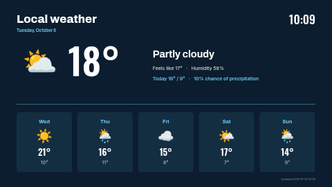

# Weather forecast

Current conditions and a five-day forecast, laid out as a slide. The numbers come from one of your
own **Weather data sources** — your server fetches the weather (Open-Meteo by default, no key
needed) and the template only arranges it.

**Kind:** slide (declarative — no code runs). Works on every ScreenTinker player that shows slides.

## Before you use it

Create a data source of type **Weather** (Data Sources → New → Weather) with your location, units
and language. Then pick it in this template's **Weather data source** setting. Units (°C/°F) and
day names follow the data source's settings.

## Settings

| Setting | Type | Default |
| --- | --- | --- |
| Weather data source | data source (required) | — |
| Location name | text (60) | `Local weather` |
| Temperature suffix | text (4) | `°` (use `°C` or `°F` if you prefer) |
| Accent / Background / Text colour | colour | `#6CC4F0` / `#0B1D2E` / `#FFFFFF` |
| Clock timezone / Date language / Clock format | timezone / locale / select | the screen's own / 24-hour |

## How it reads the data

Every value is a `{{ds:<source>.<key>}}` reference, built from the chosen source as
`{{ds:{{param:weather}}.temperature}}`. It uses `icon`, `temperature`, `condition`,
`apparent_temperature`, `humidity`, `day0_high/low/precip_prob` (today) and `day1…day5`
`_name/_icon/_high/_low`, plus `updated`. The icons are the data source's emoji, drawn by the
player's own emoji font.

Licence: MIT (see `LICENSE`).
