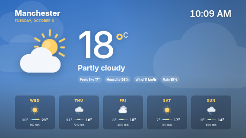

# Weather — animated

A full-screen weather scene. The sky, drifting clouds, rain, snow, fog or lightning follow the
current conditions (and go dark at night), with the current reading, feels-like, humidity, wind and
rain chance, and a five-day forecast whose bars share one temperature scale so the week reads at a
glance.

**Kind:** html (code, reviewed). **Network:** none. It reads `ST.data.weather`, which your server
fills from your own Weather data source — the template never talks to a weather service.

## Before you use it

Create a data source of type **Weather** (Data Sources → New → Weather) and pick it in the
**Weather data source** setting. Units, day names and the place name come from the data source.
Until its first sync the template shows "Waiting for weather data".

## Settings

| Setting | Type | Default |
| --- | --- | --- |
| Weather data source | data source (required) | — |
| Location name | text (60) | empty = the data source's place name |
| Background | Follows the weather / Solid colour | Follows the weather |
| Solid background colour | colour | `#0E1A2B` |
| Accent colour | colour | `#FFD166` |
| Animate the scene | checkbox | on — turn off on very low-powered players |
| Show the clock | checkbox | on |
| Clock timezone / Clock and date language | timezone / locale | the screen's own |

## Files

`index.html`, `style.css`, `app.js`; `fonts/inter.woff2` (SIL OFL 1.1, see `NOTICE`). Icons are
drawn in code — no image files, no emoji font needed.

Licence: MIT (see `LICENSE`); bundled font OFL-1.1.
