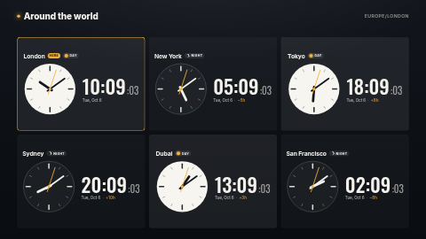

# World clocks

Two to eight live clocks for the cities you work with — analog, digital or both — each with the
date, a day/night cue and the difference in hours from the screen's own timezone. The clock for
the screen's own city is outlined. It arranges itself for the zone it is in: a grid full screen, a
list in a portrait zone, and a single row in a thin strip.

**Kind:** html. Every time is the screen's own clock run through the browser's timezone database
(`Intl.DateTimeFormat` with `timeZone`); nothing is fetched (`"network": []`).



## Settings

| Setting | Type | Default | What it does |
| --- | --- | --- | --- |
| Title | text (40) | `Around the world` | Top left. Empty hides the title bar (and gives the clocks the room). The screen's timezone is shown top right. |
| Clocks | textarea | London, New York, Tokyo, Sydney, Dubai, San Francisco | One per line, **`City \| IANA timezone`** — see below. |
| Clock style | select | Analog and digital | Or analog only, or digital only. |
| Clock format | select | 24-hour | 12-hour adds AM/PM (in the date language). |
| Show seconds | checkbox | on | The seconds hand and the small `:ss` digits. |
| Show the date | checkbox | on | e.g. `Thu, Oct 1` in each clock's own timezone. |
| Show day and night | checkbox | on | Clocks in daytime get a light face and a sun; at night a dark face and a moon. Off hides the chip; the faces still follow the hour. |
| Day starts at / Night starts at | number | `7` / `19` | The hours (in each city's own time) that count as day. |
| Highlight this screen's city | checkbox | on | Outlines the clock whose timezone is the screen's, with the label below. |
| This screen's timezone | timezone | empty = the screen's own setting | Set it if your players run on UTC but sit in, say, Chicago. Used for the highlight and the `+5h` / `−8h` differences. |
| Label on the highlighted clock | text (16) | `Here` | |
| Date language | locale | empty = the screen's language | e.g. `de-DE`, `ja-JP`. |
| Accent / Background / Text colour | colour | `#F2B13C` / `#0D1117` / `#F3F1EC` | The accent colours the seconds hand, the highlight and the hour differences. |

### The clocks list

```
London | Europe/London
Mumbai | Asia/Kolkata
São Paulo | America/Sao_Paulo
Asia/Singapore
```

- The part after `|` is an [IANA timezone](https://en.wikipedia.org/wiki/List_of_tz_database_time_zones)
  such as `America/New_York` — never an abbreviation like `EST`, which does not know about summer
  time. Summer time is then handled automatically, per city.
- A line with no `|` is taken as the timezone alone, and the city is named after it (`Singapore`).
- A line whose timezone the screen does not recognise is **skipped**, and listed in a small note at
  the bottom of the screen ("Skipped — unknown timezone: …") so you can fix the typo. Nothing breaks.
- Up to 8 clocks are shown; extra lines are ignored and counted in the same note.
- Half- and quarter-hour zones are fine: Mumbai shows `+4:30h` from London.

## Layouts

- **Full screen / landscape:** up to 4 clocks in one row, 5–8 in two rows.
- **Portrait** (taller than wide): one clock per row, analog face left, time right.
- **Strip** (more than about 3.2 times as wide as tall): one row, no title bar.

Everything is sized from the zone (vw/vh), so a 720p panel and a 4K panel show the same composition.

## Files

- `index.html`, `style.css`, `app.js` — the page (one timer, re-armed each second; no DOM is rebuilt per tick)
- `fonts/` — Inter and Oswald (SIL OFL 1.1, licence texts alongside; see `NOTICE`)
- `thumbnail.png` — catalog preview

Licence: MIT (see `LICENSE`); fonts under the SIL Open Font License 1.1.
